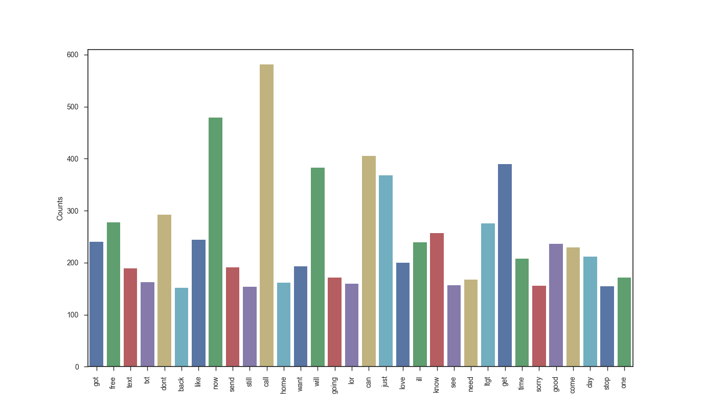

# SMS-spam-classifier

## Introduction
Text mining is commonly used to provide some general description of unustructured data (e.g, single text or multiple 
collected user messages). This operation is important not just for exploratory data analysis purposes, but also when 
preprocesing data, a required step in order to feed a machine learning technique such as a classification algorithm. 
Here a small dataset of 5547 SMS messages (4827 regular and 747 spam) is briefly analyzed and converted numerically using tf-idf.
The goal here is to evaluate the generalization capacity of the following classification algorithms: naïve Bayes, logistic regression, support vector machine (SVM), and multi-layer perceptron (MLP) neural networks. A 10-fold cross-validation approach is implemented using Python3 programming language, using the following modules:  
```numpy, pandas, scikit-learn, wordcloud, nltk,``` and ```string.```


## Directions

1- Run the exploratory data analysis script:
```bash
	python3 EDA.py
```

So you can get some plots like this bar plot with words with counts superior to 150 times:

<p align="center">
  
</p>


A word cloud, and a monthly counts bar plot whether messages is spam or not will be also provided with some other descritive statistics at the terminal output.


2- Run a 10-fold cross-validation using one of the following commands: 
```bash
        python3 naiveBayes.py  # evaluate a naïve Bayes
	
	python3 logisticReg.py  # evaluate a logistic regression
	
	python3 svm.py  # evaluate a SVM
	
	python3 MLP.py  # evaluate a MLP neural network
```

A output will print out the error and estimates for f1-score, precision and recall metrics.
